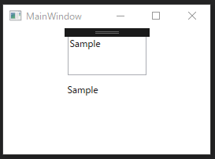

# wpf-mvvm-notify-pattern

```cs
public class ViewModel : Notifier
{
    public ViewModelPropertyChangedEventManger VmPropsChangedManager { get; set; }
    private string _sampleTextBox;
    private string _sampleTextBlock;

    public ViewModel()
    {
        this.VmPropsChangedManager = new ViewModelPropertyChangedEventManger(this);
    }

    public string SampleTextBox
    {
        get => _sampleTextBox;
        set => SetProperty(ref _sampleTextBox, value, nameof(SampleTextBox));


    }
    public string SampleTextBlock
    {
        get => _sampleTextBlock;
        set => SetProperty(ref _sampleTextBlock, value, nameof(SampleTextBlock));
    }

}

```

  
application image
